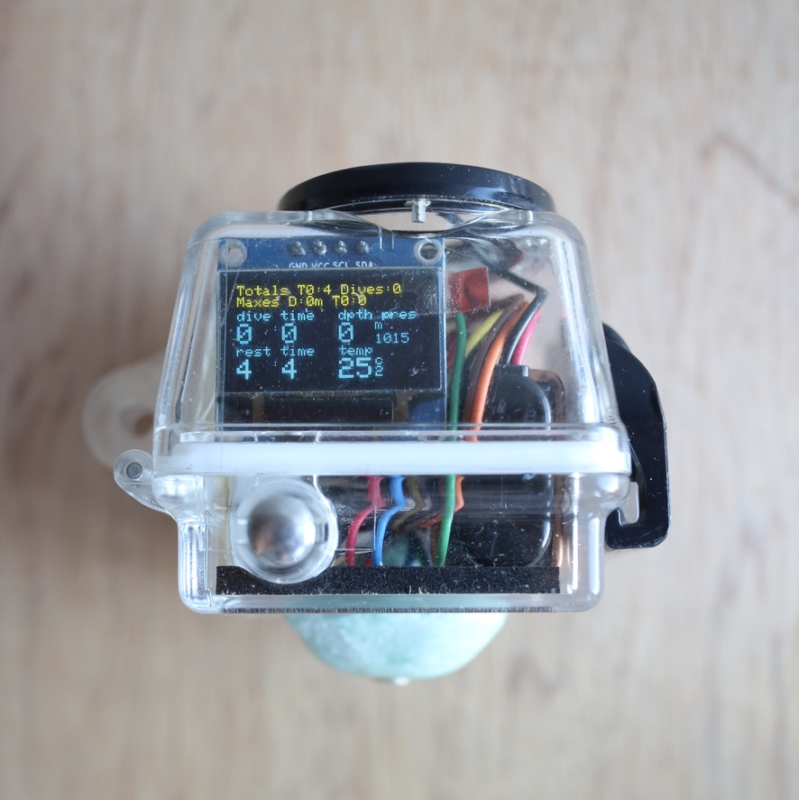
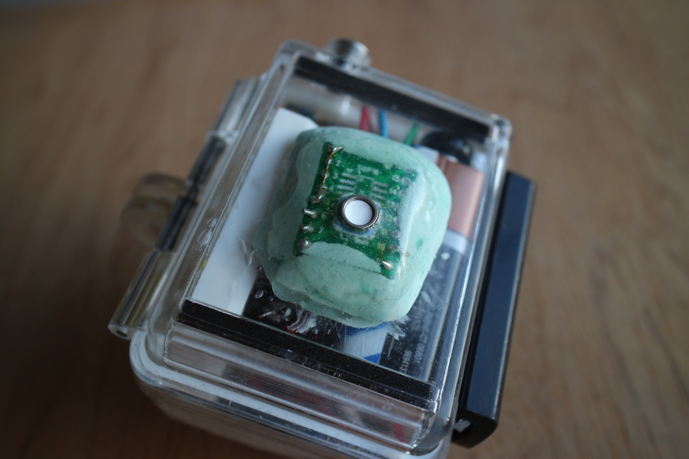
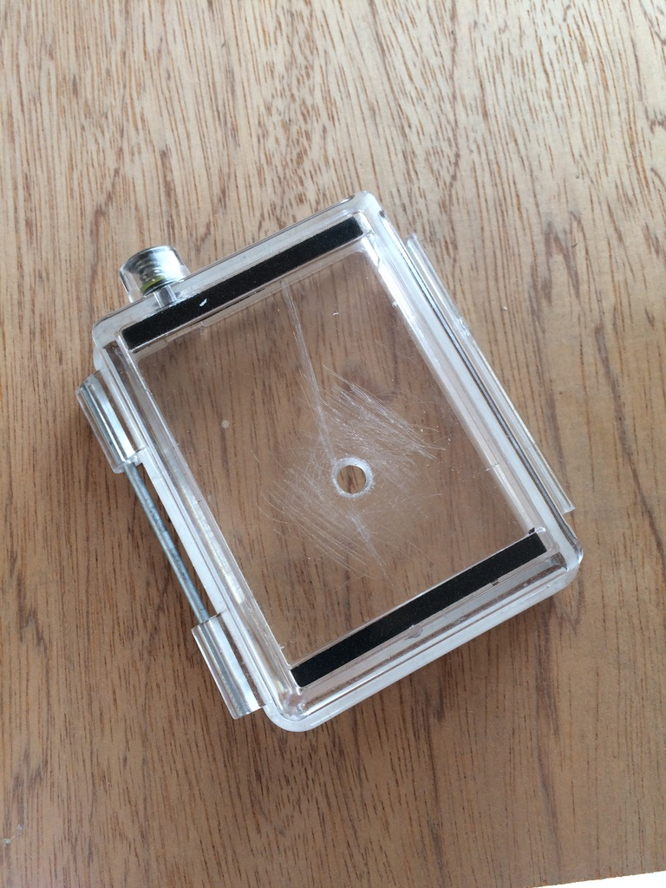
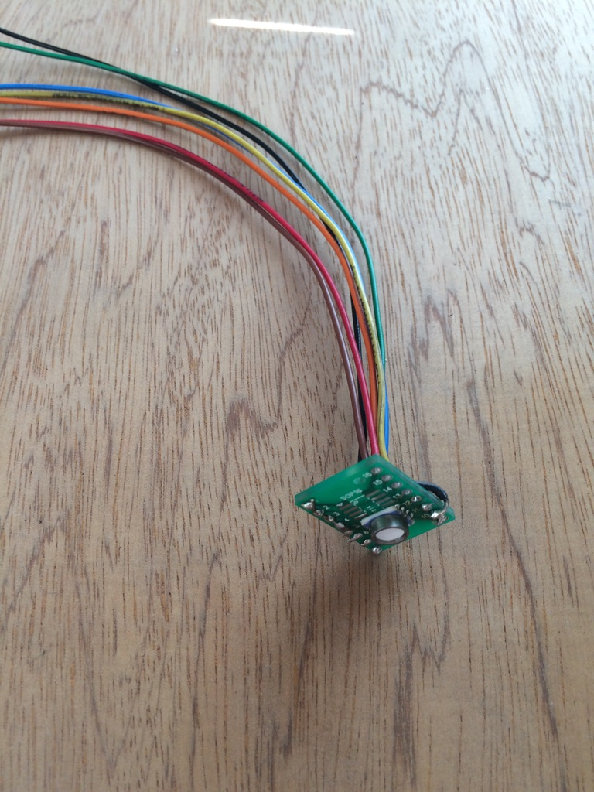
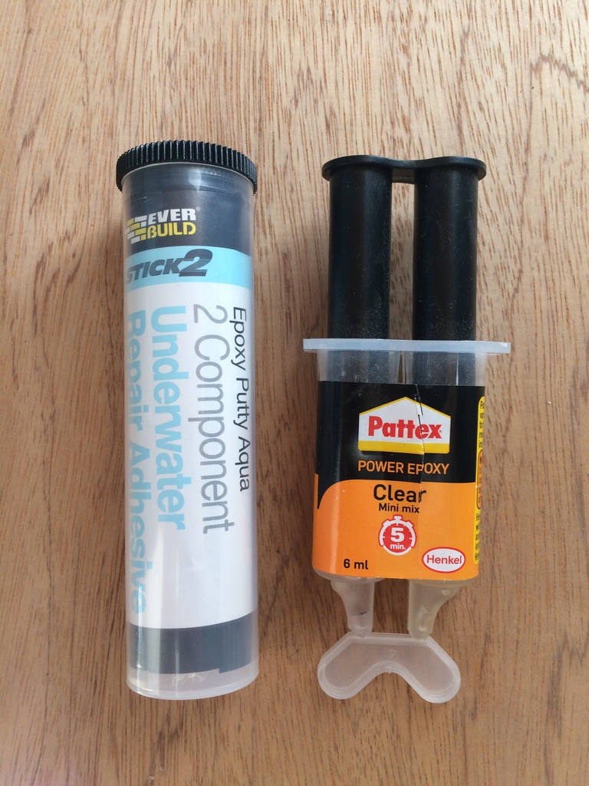
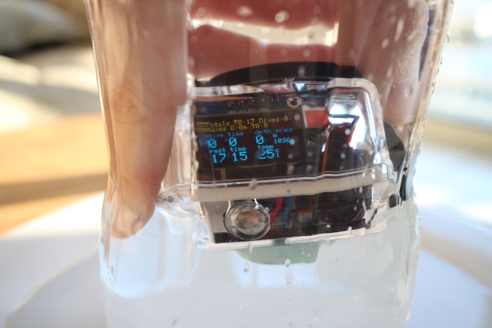
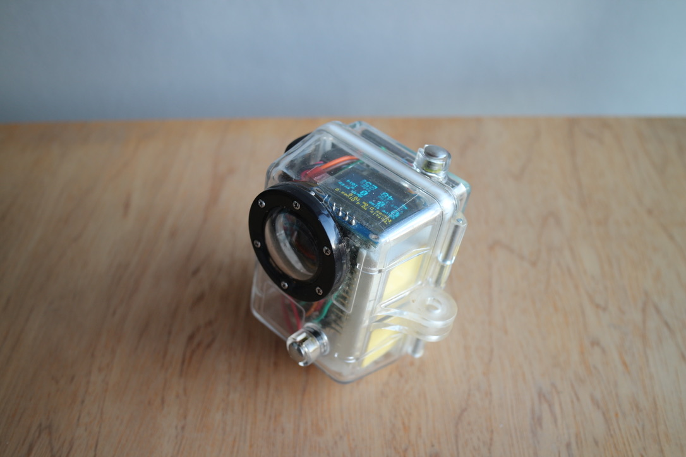

# Freedive Watch
A freediving watch built with MS5803-14BA P/T sensor and I2C OLED screen, housed in a GoPro housing

## About
The watch/computer is a weekend DIY project which measures and displays useful information during freedives.

### Features:
- Total excursion time
- Dive count
- Max depth reached
- Max dive length
- Current depth and pressure
- Current water temperature 
- Current dive length
- Last dive length
- Rest timer
- No-input UI: automatic switching between dive and rest modes
- Screen colour inversion during dive to clearly indicate mode
- Serial simulation mode to aid in development

## Technical information

### Parts
|part|model|
|---|---|
|Pressure/Temp Sensor|MS5803-14BA (TE Connectivity)|
|Microcontroller|A-Star 328PB Micro - 3.3V, 8MHz|
|Display|Generic Dual Colour 0.96" I2C OLED|
|Power|9V Battery|

During idle, the unit draws 13.4mAh @ 9V (120.6mW) ∴ expected battery life with typical 500mAh 9V battery is ~37 hours. 

### Libraries
|Purpose|Library|
|---|---|
|Sensor interfacing|[Sparkfun MS5803](https://github.com/sparkfun/MS5803-14BA_Breakout)|
|OLED interface|[Adafruit SSD1306](https://github.com/adafruit/Adafruit_SSD1306)|
|Graphics|[Adafruit GFX](https://github.com/adafruit/Adafruit-GFX-Library)|
|Dive information|Custom `Dive` library, included in repo|

### Hardware

##### Housing
To avoid the headaches of custom waterproof enclosures, the project used an old GoPro (Hero 2?) housing. A hole drilled in the back cover allowed a passthrough for sensor connections

##### Sensor Preparation
If ordered directly, the sensor will come as-is and the pins needs to broken out, and wires attached. This was done with a generic SOP16 breakout, although something smaller would be ideal. A decoupling cap was also added onto the board.

##### Waterproofing and sealing
The sensor breakout needs to be carefully waterproofed, and the cable passthrough needs to be sealed. Waterproof epoxy **putty** was used to seal the passthrough and seat the sensor breakout. Although not pictured, putty was applied on the inside of the enclosure, too, in order to further seal the passthrough. The sensor breakout was then covered in two-part, clear, **liquid** epoxy.

> #### NB The inner diameter (white disc) of the sensor needs to be exposed to the environment, and extreme care needs to be taken to keep it clear of epoxy. Failure to do so would ruin the sensor!

## To do

- Real world tests! (The project was completed during corona lockdown)
- Protect the sensor whith a plastic shroud, and perhaps apply another layer of epoxy around it. 
- Use a LiPo battery
- Create custom PCB to connect components. Currently on a breadboard.
- Use the GoPro housing's buttons as a latching power button

>_Testing in column of freshwater_
>
>  Note increase in pressure from 1015mbar to 1036mbar, indicating ~21cm depth. Mode stays in *rest* as this is <1m depth. 

## Gratitude

- The [Cave Pearl Project](https://thecavepearlproject.org/) has been an invaluable source of inspiration and information
- Sparkfun and Adafruit, for their libraries. If you can, buy parts from them!

